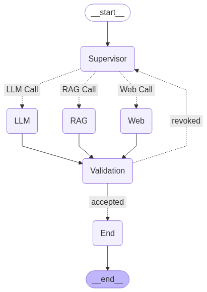

# 🍲 Recipe-Finder-Assistant

Recipe-Finder-Assistant is an AI-powered assistant that helps users find recipes, answer cooking-related questions, and provide up-to-date information using Retrieval-Augmented Generation (RAG), LLMs, and web search.

## Demo Video 


## Features

- **Recipe Search:** Extracts and retrieves recipes from a PDF cookbook using semantic search.
- **LLM Q&A:** Answers general cooking and cuisine questions using a large language model.
- **Web Search:** Provides recent or trending information by searching the web.
- **Smart Routing:** Automatically selects the best method (RAG, LLM, or Web Search) based on the user's query.
- **Answer Validation:** Evaluates the quality of responses before presenting them to the user.
- **Streamlit UI:** Interactive chat interface for seamless user experience.

## Project Structure

. ├── main.py
  ├── requirements.txt 
  ├── .env 
  ├── agents/ │ 
    ├── __init__.py │ 
    ├── llm.py │ 
    ├── rag.py 
    │-- webSearchAgent.py 
  ├── data/ 
    │ ── recipe.pdf  
  │── README.md


## Setup

1. **Clone the repository:**
   ```sh
   git clone <repo-url>
   cd Recipe-Finder-Assistant

2. **Install dependencies:**
   pip install -r requirements.txt

3. **Set up environment variables:**  
     Create a .env file with your API keys:
       HF_TOKEN=your_huggingface_token
       GROQ_API_KEY=your_groq_api_key
       TAVILY_API_KEY=your_tavily_api_key
       LANGCHAIN_API_KEY=your_langchain_api_key

5. **Add your recipe PDF:**
   Place your cookbook PDF in the data/ directory as recipe.pdf.

## Usage
  Run the Streamlit app:
  streamlit run [main.py](http://_vscodecontentref_/8)

## How It Works

- **PDF Processing:** The assistant loads and splits the recipe PDF into chunks, then creates a vector store for semantic search.
- **Query Routing:** User queries are analyzed and routed to the appropriate agent:
  - **RAG:** For queries related to the cookbook.
  - **LLM:** For general or basic cooking questions.
  - **Web Search:** For recent or trending topics.
- **Validation:** Each answer is validated for relevance before being shown to the user.

## Output Graph


## Dependencies

See `requirements.txt` for the full list.

## License

MIT License

License
MIT License
